<h1>Calculadora de pré-build Genshin Impact</h1>

<h3>Introdução</h3>

Eu, como um jogador de genshin impact, precisava fazer diversos cálculos para equilibrar minhas builds(Organização dos itens do personagem.)

<h3>Funcionalidades</h3>

Atualmente, ele só serve para calcular os valores da build que deseja. Porém futuramente pretendo adicionar uma funcionalidade que acompanha sua build, que o usuário consiga cadastrar os artefatos e o programa sugira alterações!   

<h3>Como funciona?</h3>

Pra quem ja tem familiaridade com o jogo, é bem simples! você precisa ter em mente apenas algumas coisas:

<ol>
  <li>Se o personagem quando upa, ganha taxa ou dano crítico.</li>
  <li>Reconhecer se a arma que vai utilizar ganha taxa ou dano crítico.</li>
  <li>O cv(Critical value) que deseja alcançar nos seus artefatos.</li>
  <li>Se o conjunto de artefatos utilizado influencia no crítico.</li>
</ol>

Ao rodar o código basta apenas responder as perguntas e esperar os resultados!

<h3>Utilização na prática</h3>

Como menncionei, basta apenas rodar o código e responder as perguntas.

utilizarei meu persomagem "Varka" como exemplo.

 
    <ul>
    <li>
        
Na primeira resposta, apenas insira se quando ele upa, ele ganha taxa ou dano crítico. Caso não seja nenhum dos dois, você pode simplesmente escrever qualquer coisa para pular.

        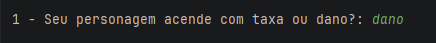
    </li> 
    <li>
        
Na segunda resposta, apenas insira a taxa crítica que a arma fornece. Caso a arma não possua, simplesmente coloque 0.

        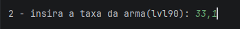
        
Como meu varka possui uma arma com taxa de dano, colocarei nos 2 campos.

        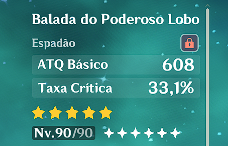
    </li> 
    <li>
        
Na terceira resposta, apenas insira o dano crítica que a arma fornece. Caso a arma não possua, simplesmente coloque 0.

        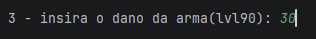 
        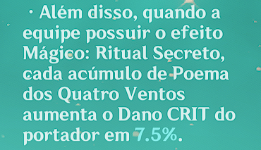

    </li> 
    <li>
        
Na quarta resposta, apenas insira o valor crítico que deseja. Recomendo no mínimo 180, vai de acordo com suas exigências.

        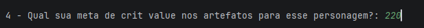
    </li> 
    <li>
        
Na quinta resposta, apenas insira a taxa crítica que o bonus de conjutno utilizado(ou que pretende utilizar) proporciona. Bem variável.

        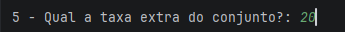 
        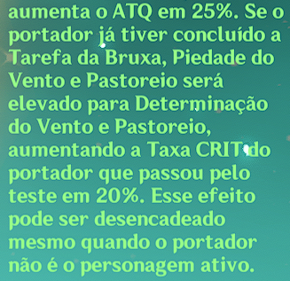
    </li>
</ul>

<h3>Resultados!</h3>
<ul>
    <li>
        
Aqui estão os cálculos, porém apennas o "CV ideial" e "build estimada" importam.

        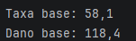
    </li> 
    <li>
        
O "CV ideal" serve para ser o número aproximado que você deve visualizar assim que abrir sua build, o meu por exemplo, deu 21,9 de taxa / 176,2 de dano

        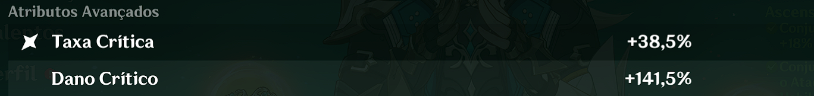
        
Como podemos ver, eu tenho muito mais taxa do que dano nessa build, mas está aproximado pois 1 ponto de taxa equivale a 2 pontos de dano.

    </li> 
    <li>
        
A "build estimada" são os números que devemos buscar quando todos nossos buffs de armas e artefatos estiverem ativos.

        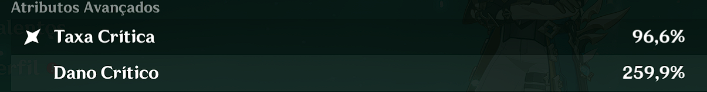
    </li>
</ul>

<h3 align="center">Considerações finais</h3>

Esse programa foi feito com base no MEU métodos de equilibrar esses números, não uma verdade absoluta.  Reconheco, que o programa está bem simples e confuso, e sei que é possível melhorar e evoluir muito mais com polimorfismo e herança. Devo mexer em algumas coisas também, como adicionar a ressonância cryo e verificar se o perosnagem possui alguma aumento de taxa no próprio kit.

